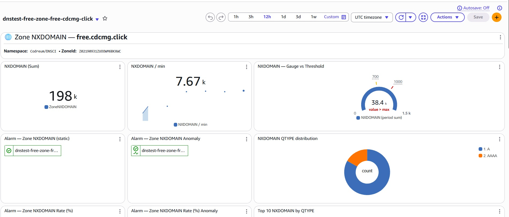
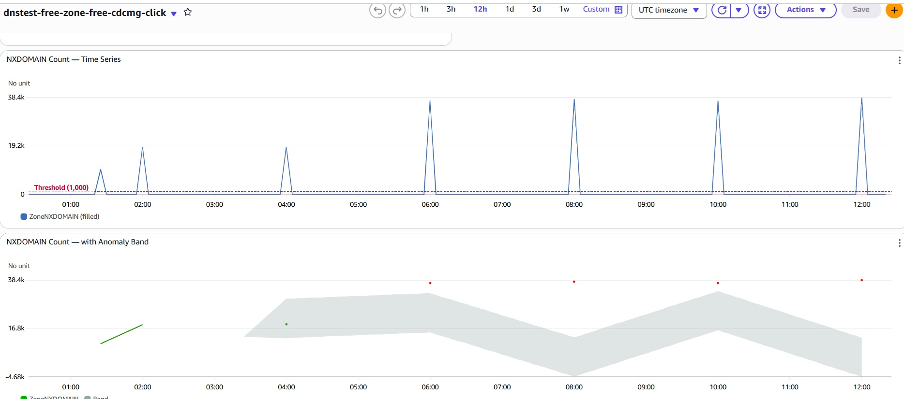
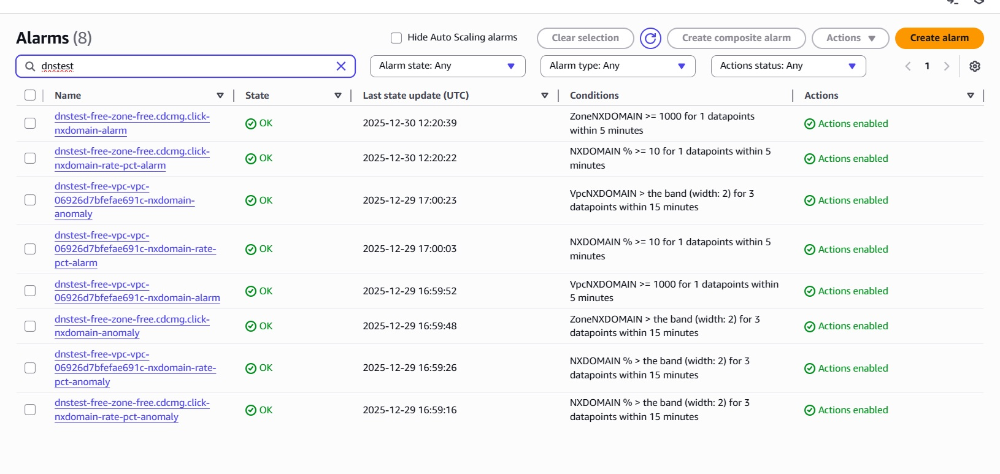
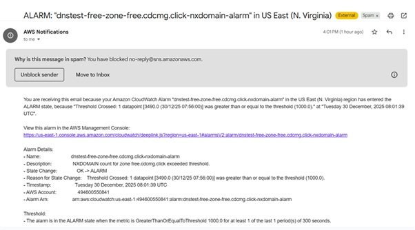
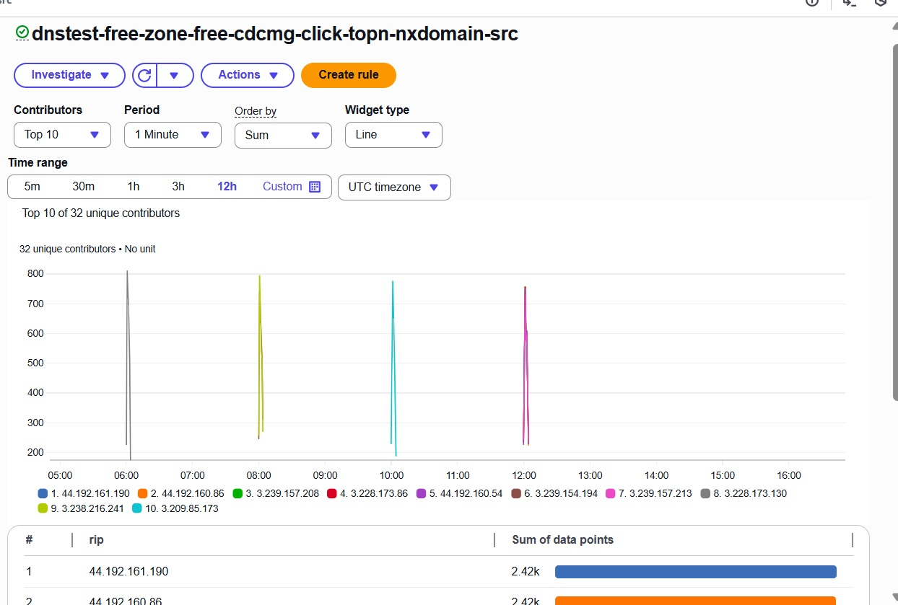

<p align="center">
  <a href="https://github.com/Codreum/terraform-aws-dns-monitoring-nxdomain/actions/workflows/ci.yml">
    
  </a>

  <a href="https://scorecard.dev/viewer/?uri=github.com/Codreum/terraform-aws-dns-monitoring-nxdomain">
    
  </a>

  <a href="https://www.bestpractices.dev/projects/11896">
    
  </a>
</p>

<p align="center">
  <a href="https://github.com/Codreum/terraform-aws-dns-monitoring-nxdomain/releases">
    
  </a>

  <a href="https://github.com/Codreum/terraform-aws-dns-monitoring-nxdomain/blob/main/LICENSE">
    
  </a>
</p>

<p align="center">
  <a href="https://www.codreum.com">
    
  </a>
</p>

<p align="center">
  <a href="https://www.codreum.com">Website</a> •
  <a href="https://www.codreum.com/products.html#zone">Upgrade</a> •
  <a href="#quickstart">Quickstart</a>
</p>

# Codreum DNS Monitoring (NXDOMAIN)

Detect DNS misconfigurations fast by alerting on **NXDOMAIN spikes** using **AWS CloudWatch + Terraform**.

✅ Dashboards + alarms + anomaly detection

✅ Works with **Route 53 hosted zone query logs** + **Resolver query logs (VPC)**

✅ Top-N triage views (domain / qtype / edge / source)

This solution is for **NXDOMAIN signals only**. **Codreum Pro** adds broader DNS error metrics and investigation dashboards.

- **Deploy:** jump to [Quickstart](#quickstart)
- **Website:** [https://www.codreum.com](https://www.codreum.com)
- **Upgrade:** [https://www.codreum.com/products.html#zone](https://www.codreum.com/products.html#zone)

---

## Why NXDOMAIN matters

NXDOMAIN means “this name does not exist.” A spike is rarely random — it’s usually a signal that **something changed**.

Common causes:

- broken deployments (wrong domain, missing records, bad service discovery)
- misconfigured clients / endpoints (typos, outdated configs, DNS suffix issues)
- malware / beaconing attempts (random subdomains, DGA patterns)
- expired records or incorrect resolver paths

Why it’s valuable:

- **Fastest indicator of DNS regressions** (before app errors explode)
- Helps pinpoint **what** is failing and **who** is generating it (Top-N)
- Works for both **public hosted zones** and **private/VPC resolver** DNS

---

## Why AWS CloudWatch (in-account) instead of external DNS monitoring?

External checkers are useful, but they often miss the failures you actually care about:

- External monitors can only test **public DNS** and a small set of resolvers.
- They can’t see **your internal resolver traffic** (VPC Resolver logs).
- They typically miss **client-specific failures** and “partial outages” (only some subnets, only some clients, only some edges).

This module uses **your real DNS query logs** inside AWS:

- captures failures from **real production clients**
- supports **private/internal DNS** (VPC resolver queries)
- triages by **top offending domain / qtype / edge / source IP**
- avoids shipping DNS logs to third parties

> Privacy note: this module does **not** send DNS logs to Codreum. Everything stays inside your AWS account.

---

## What you get (Free)

✅ Included:

1. NXDOMAIN **count** alarm (Zone + VPC)
1. NXDOMAIN **rate (%)** alarm (Zone + VPC)
1. NXDOMAIN **Anomaly detection** alarms (count + rate)
1. CloudWatch dashboards:
   - Zone dashboard
   - VPC dashboard
   - Ops landing dashboard
1. Top-N triage views
   - Zone: Top NXDOMAIN by domain/qtype/edge/source
   - VPC: Top NXDOMAIN by qname/source
1. SNS integration: alarms publish to your provided SNS topic (`dns_alert_sns_arn`)

🚫 Not included (Free):

1. Additional DNS error metrics (SERVFAIL/REFUSED/etc.)
1. Expanded Contributor Insights packs and dashboards beyond NXDOMAIN
1. Licensing, enforcement, premium support / SLA (Pro)
1. Log group management (Pro)

| Capability | NXDOMAIN | Pro |
|---|:---:|:---:|
| NXDOMAIN static alarms + anomaly detection | ✅ | ✅ |
| NXDOMAIN Contributor Insights (Top-N rules) | ✅ | ✅ |
| NXDOMAIN dashboards (Zone/VPC baseline) | ✅ | ✅ |
| Additional DNS metrics + Contributor Insights packs (SERVFAIL/REFUSED/etc.) | ❌ | ✅ |
| Per zone metrics/Alarm/CI toggle | ❌ | ✅ |
| Per-zone metric dashboards (beyond NXDOMAIN) | ❌ | ✅ |
| Per-zone Top-N dashboards (expanded) | ❌ | ✅ |
| Built-in SNS wiring presets (Email / Slack / SMS) | ❌ | ✅ |
| Log group management | ❌ | ✅ |
| Multiple zone/VPC IDs in one deployment | ❌ | ✅ |
| Advanced dashboards (Ops landing / Investigation / Forensics) | ❌ | ✅ |
| Licensing & enforcement | ❌ | ✅ |
| Support / SLA | ❌ | ✅ |

---

## How it works (simple architecture)

This module:

1. reads from an existing CloudWatch Logs group containing DNS logs (`NX_log_group_name`)
1. creates:
   - Log metric filters → custom metrics in `Codreum/DNSCI`
   - CloudWatch alarms (static + rate % + anomaly)
   - Contributor Insights rules + Logs Insights widgets (Top-N triage)
   - Dashboards (zone, vpc, ops landing)
1. sends alarm notifications to your SNS topic (`dns_alert_sns_arn`)

---

## Prerequisites

1. Terraform >= 1.12
1. AWS provider >= 6.2
1. A CloudWatch Logs group already receiving DNS logs:
   - **Zone mode:** Route 53 hosted zone query logs (CLF-like fields include `hosted_zone_id`, `rcode`, `qname`, etc.)
   - **VPC mode:** JSON resolver query logs (fields include `vpc_id`, `rcode`, `srcaddr`, `query_name` / `qname`, etc.)
1. Region constraints (AWS limitation)
   - **Zone mode (`NX_zone_id`)**: Route 53 *public hosted zone* query logging requires the CloudWatch Logs log group in **`us-east-1` (US East / N. Virginia)**. Deploy this module in **`us-east-1`** for Zone mode.
   - **VPC mode (`NX_vpc_id`)**: Resolver query logging is **regional**. Create the query logging configuration and destination (CloudWatch log group) in the **same region as the VPC**. If you have VPCs in multiple regions, deploy one module per region.
   - If you need both Zone + VPC monitoring across different regions, deploy **two module instances**: one in **`us-east-1`** for Zone mode, plus one per VPC region for Resolver mode.

---

## Configuration

Required:

- `prefix`
- `aws_region`
- `NX_log_group_name`
- `dns_alert_sns_arn`
- Provide at least one:
  - `NX_zone_id` (enables zone alarms/dashboards/widgets)
  - `NX_vpc_id` (enables vpc alarms/dashboards/widgets)

You can enable zone monitoring, VPC monitoring, or both.

---

## Quickstart

1. Ensure DNS query logs are flowing into CloudWatch Logs:

   - Hosted zone query logs (CLF-like)
   - Resolver query logs (JSON)

1. Copy/paste into `main.tf`:

```hcl
module "codreum_dns_NX" {
  source = "github.com/Codreum/terraform-aws-dns-monitoring-nxdomain//modules?ref=v1.0.0"

  prefix              = "acme-dev"
  aws_region          = "us-east-1"
  NX_log_group_name = "/aws/route53/resolver-query-logs"  # must match your CloudWatch log group name
  dns_alert_sns_arn   = "arn:aws:sns:us-east-1:123456789012:alerts" # change to your SNS ARN

  # Enable one or both:
  NX_vpc_id  = "vpc-0123456789abcdef0" # optional
  NX_zone_id = "Z123EXAMPLE"           # optional
}
```

You can also copy the main.tf file from example folder, and make the minimal edit

- replace  module source with "github.com/Codreum/terraform-aws-dns-monitoring-nxdomain//modules?ref=v0.1.0"
- Change NX_log_group_name , dns_alert_sns_arn, NX_vpc_id or/and NX_zone_id to your own resource
- Change the aws_region to the VPC Region, if you are using VPC Mode
- If using Zone mode, make sure aws_region = "us-east-1" (required by Route 53 query logging)

1. (optional) this module exports dashboard URLs, alarm ARNs, and metric names via Terraform outputs. If you want the output, paste this code too into your own main.tf

```hcl
output "dns_NX_enabled" {
  value = module.codreum_dns_NX.enabled
}

output "dns_NX_dashboards" {
  value = module.codreum_dns_NX.dashboards
}

output "dns_NX_alarms" {
  value = module.codreum_dns_NX.alarms
}

output "dns_NX_metrics" {
  value = module.codreum_dns_NX.metrics
}

output "dns_NX_ci_rules" {
  value = module.codreum_dns_NX.contributor_insights_rules
}
```

You can also copy the output.tf file from example folder

1. Deploy :

terraform init

terraform apply

## What you’ll see after deploy

After `terraform apply`, you’ll have CloudWatch **dashboards**, **alarms**, and **Contributor Insights** rules created in your AWS account.

> Tip: Open **CloudWatch → Dashboards** and search for your `prefix` (e.g., `acme-dev-*`).

### 1) Dashboards (Ops / Zone / VPC)

You’ll get an Ops landing page plus dashboards for the modes you enabled:

- **Ops landing**: quick links + “what to check first”
- **Zone dashboard** (if `NX_zone_id` is set): NXDOMAIN count, rate %, anomaly band, Top-N breakdowns
- **VPC dashboard** (if `NX_vpc_id` is set): NXDOMAIN count, rate %, anomaly band, Top-N by source/qname






#### How to use

- If alarms fire, start at **Ops landing**, then jump into **Zone/VPC** dashboard.
- Use **Top-N** tables to identify the top failing domains, qtype, edge, and source IPs.

---

### 2) Alarms (Count / Rate / Anomaly)

This module creates alarms for:

- **NXDOMAIN count** (static threshold)
- **NXDOMAIN rate (%)** (error rate)
- **Anomaly detection** on both count and rate

Alarms publish to your SNS topic (`dns_alert_sns_arn`).






#### What to check

- **Count alarm**: sudden volume spike (often broken deploy / client loop)
- **Rate alarm**: NXDOMAIN becoming a larger share of total queries
- **Anomaly alarms**: unexpected behavior even if below static thresholds

---

### 3) Contributor Insights (Top-N triage)

Contributor Insights rules are used for “Top-N” analysis (fast triage):

- Zone: top NXDOMAIN by **qname / qtype / edge / source**
- VPC: top NXDOMAIN by **qname / source**




#### How to use (Contributor Insights)

- Open **CloudWatch → Contributor Insights**
- Filter by your `prefix`
- Start with **Top qname** and **Top source** to quickly locate the cause

## Upgrade to Codreum Pro

Codreum Pro adds:

1. More DNS metrics (SERVFAIL/REFUSED/overall error, success rate, etc.)
1. More pre-built metric alarms, contributor insight packs
1. More dashboards with richer, opinionated investigation widgets
1. subscription management & support options
1. Multi-zone / multi-vpc support
1. Optional prebuilt alerting integrations (email / Slack / SMS) via SNS setup

Learn more: [https://www.codreum.com/products.html#zone](https://www.codreum.com/products.html#zone)

## Costs (AWS billed)

This module creates CloudWatch resources that may incur AWS charges, depending on usage, region, and free tier.

- **Contributor Insights rules**: used for Top-N analysis (e.g., top NXDOMAIN domains/clients). Charged per rule and usage.
- **Custom metrics**: metric filters publish metrics under `Codreum/DNSCI` (e.g., `ZoneNXDOMAIN`, `VpcNXDOMAIN`). Custom metrics may be billed by AWS.
- **CloudWatch alarms**: static threshold, rate (%), and anomaly alarms may be billed by AWS.

See AWS pricing: [https://aws.amazon.com/cloudwatch/pricing/](https://aws.amazon.com/cloudwatch/pricing/)

## Security & data

- This module does **not** send DNS logs to Codreum.
- All analysis happens inside your AWS account using CloudWatch Logs / Metrics / Contributor Insights.
- Alarm notifications are published only to your SNS topic.

## Signed releases & provenance

Every GitHub Release for this project includes **cryptographically signed artifacts** and **SLSA provenance**.

### What’s included in a release

Typical release assets include:

- `terraform-aws-dns-monitoring-nxdomain-<version>.tar.gz` (packaged source)
- `SHA256SUMS` (checksums)
- `sbom.spdx.json` (SBOM)
- `*.sigstore.json` (Sigstore “bundle” signatures for the files above)
- `multiple.intoto.jsonl` (SLSA provenance)

> Signatures are created using **cosign keyless signing** via GitHub Actions OIDC (no long-lived keys).

### Verify signatures (cosign)

1) Download a release asset and its corresponding `*.sigstore.json` bundle from the GitHub Release assets.

2) Verify the artifact:

```bash
VERSION=v1.0.0
cosign verify-blob   --bundle terraform-aws-dns-monitoring-nxdomain-${VERSION}.tar.gz.sigstore.json   terraform-aws-dns-monitoring-nxdomain-${VERSION}.tar.gz
```

Verify the other assets the same way:

```bash
cosign verify-blob --bundle SHA256SUMS.sigstore.json SHA256SUMS
cosign verify-blob --bundle sbom.spdx.json.sigstore.json sbom.spdx.json
```

### Verify provenance (SLSA)

Each release includes a provenance file (e.g. `multiple.intoto.jsonl`). Verify that the artifact was built from this repository/tag:

```bash
REPO="github.com/Codreum/terraform-aws-dns-monitoring-nxdomain"
VERSION=v1.0.0

slsa-verifier verify-artifact   --provenance-path multiple.intoto.jsonl   --source-uri "${REPO}"   --source-tag "${VERSION}"   terraform-aws-dns-monitoring-nxdomain-${VERSION}.tar.gz
```

## Limitations (Free)

- Designed for **one zone and/or one VPC** per deployment.
- Only NXDOMAIN signals are included.
- Assumes logs already exist in CloudWatch Logs.

## Support

- Free: community support via GitHub Issues
  - Bug reports: open an issue using the **Bug report** template
  - Feature requests: open an issue using the **Feature request** template
- Contributing: see CONTRIBUTING.md (PRs welcome)
- Security issues: see SECURITY.md

Quick links:

- [Issues](https://github.com/Codreum/terraform-aws-dns-monitoring-nxdomain/issues)
- [New issue (choose template)](https://github.com/Codreum/terraform-aws-dns-monitoring-nxdomain/issues/new/choose)
- [Contributing](https://github.com/Codreum/terraform-aws-dns-monitoring-nxdomain/blob/main/CONTRIBUTING.md)
- [Security](https://github.com/Codreum/terraform-aws-dns-monitoring-nxdomain/blob/main/SECURITY.md)
